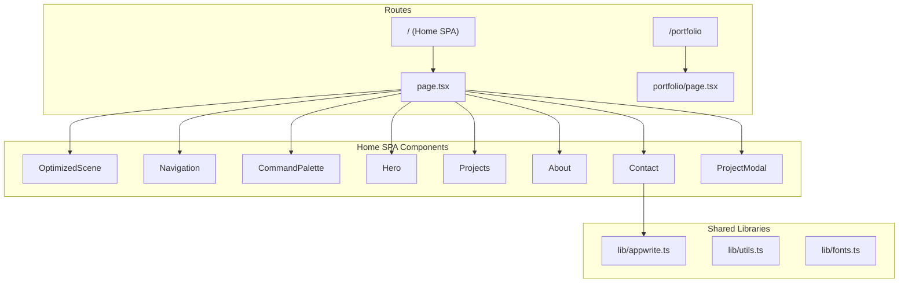

# BytesFang Portfolio

A **Next.js 16** personal portfolio website featuring real-time **Three.js 3D backgrounds**, **Framer Motion animations**, **glassmorphism UI**, and an **Appwrite backend** for the contact form.

## Tech Stack

| Layer | Technology |
|---|---|
| Framework | Next.js 16 (App Router) |
| Language | TypeScript |
| Styling | Tailwind CSS 4 + custom glassmorphism utilities |
| 3D Rendering | Three.js (raw WebGL) |
| Animation | Framer Motion |
| Icons | Lucide React |
| Backend | Appwrite (Databases SDK for contact form) |
| Fonts | Geist Sans & Geist Mono |

## Architecture



## Routes

### Route 1: Home SPA (`/`)

A **state-driven single-page app** that swaps between 4 sections using Framer Motion's `AnimatePresence`:

| Section | Component | Description |
|---|---|---|
| `hero` | `Hero.tsx` | Landing with gradient headline, "Available for work" badge, CTA buttons |
| `projects` | `Projects.tsx` | Scrollable project list. Clicking opens `ProjectModal` |
| `about` | `About.tsx` | Bio + skills grid (Frontend/Backend/Design) in a glassmorphism card |
| `contact` | `Contact.tsx` | Contact form that submits to **Appwrite Databases** |

**UI Overlays:**
- **Navigation** — Fixed top nav with brand logo, glassmorphism pill nav, CMD+K trigger, GitHub/LinkedIn icons
- **CommandPalette** — Spotlight-style command palette (`Cmd+K`) with filterable navigation commands
- **ProjectModal** — Slide-in-from-right drawer showing project details, tech stack, and stats

### Route 2: Portfolio Page (`/portfolio`)

A **scroll-based portfolio** with its own Three.js scene, IntersectionObserver-driven navigation, bento grid layouts, and 4 scrollable sections: Home → Curriculum → Side Projects → About.

### 3D Background

Both routes render a **raw Three.js scene** featuring:
- An icosahedron core with physical material (transmission, clearcoat)
- Wireframe overlay for a "tech" aesthetic
- Orbiting spheres and a star-field particle system
- Mouse/touch-reactive rotation
- Section-aware color theming (blue → purple → emerald → amber)

## Shared Libraries (`src/lib/`)

| File | Purpose |
|---|---|
| `appwrite.ts` | Initializes Appwrite `Client`, `Databases`, `Account` from env vars. Exports `isAppwriteConfigured()` guard |
| `utils.ts` | `cn()` helper — merges class names via `clsx` + `tailwind-merge` |
| `fonts.ts` | Exports Geist font CSS variables |

## Appwrite Integration

The contact form submits messages to an Appwrite Database collection with the following schema: `name`, `email`, `message`, `created_at`.

Full backend setup instructions are in [APPWRITE_SETUP.md](./APPWRITE_SETUP.md).

### Environment Variables

```bash
NEXT_PUBLIC_APPWRITE_ENDPOINT=https://cloud.appwrite.io/v1
NEXT_PUBLIC_APPWRITE_PROJECT_ID=your_project_id_here
NEXT_PUBLIC_APPWRITE_DB_ID=portfolio
NEXT_PUBLIC_APPWRITE_COLLECTION_ID=messages
```

## Getting Started

```bash
# Install dependencies
npm install

# Set up environment variables
cp .env.example .env.local
# Edit .env.local with your Appwrite credentials

# Run development server
npm run dev
```

Open [http://localhost:3000](http://localhost:3000) to see the Home SPA, or [http://localhost:3000/portfolio](http://localhost:3000/portfolio) for the scroll-based portfolio.

## Styling

`globals.css` provides:
- Tailwind v4 import + Geist font theme overrides
- Light/dark mode CSS variables
- Custom scrollbar styling
- `.glass-panel` and `.glass-button` glassmorphism utility classes

## Deploy

See [APPWRITE_SETUP.md](./APPWRITE_SETUP.md) for full deployment instructions on **Appwrite Sites**.
